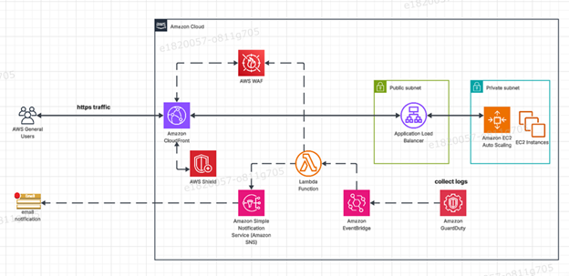

# aws-secure-web-architecture
AWS architecture for a secure web app with CloudFront, WAF, GuardDuty, EventBridge &amp; Lambda auto-remediation.
## Table of Content

- [Solution Overview](#solution-overview)
- [Solution Architecture Diagram](#solution-architecture-diagram)
- [Detailed Architecture Description](#detailed-architecture-description).
- [Recommended GitHub Repository Structure](#recommended-gitHub-repository-structure).

# 📘 Solution Overview 

This solution deploys a secure, scalable, and highly available public‑facing web application on AWS. It delivers global content distribution, intelligent threat detection, auto‑remediation, and multi‑layered security hardening.
Incoming client traffic is delivered through Amazon CloudFront, routed to an Application Load Balancer, and served by an EC2 Auto Scaling Group.
The architecture ensures:
- High scalability
- Global low‑latency delivery
- Continuous threat monitoring
- Automated remediation
- Comprehensive DDoS & application‑layer protection

It uses WAF managed rules, custom rules, and rate‑limiting to defend against SQL injection, XSS, bots, and volumetric threats. The system forms a fully automated security pipeline, ensuring strong defense with minimal human intervention. 

# 🏗️ Solution Architecture Diagram

# 📄 Detailed Architecture Description
## 1. Introduction
This architecture deploys a secure, scalable, internet‑facing web application using AWS managed services. It integrates CloudFront, ALB, EC2 Auto Scaling, AWS WAF, Shield, GuardDuty, EventBridge, Lambda, and SNS to achieve:
- Defense‑in‑depth
- Automated threat detection
- Continuous monitoring
- Real‑time remediation
- High availability and performance

## 2. High-Level Architecture Overview
Traffic is served globally through Amazon CloudFront, secured using AWS Shield and AWS WAF, then forwarded to an ALB and Auto Scaling EC2 backend to ensure availability and elasticity.
A multi‑layered security model includes:
- Edge Security: CloudFront + Shield Standard
- Application Security: WAF managed + custom rules
- Threat Detection: Amazon GuardDuty
- Automated Response: EventBridge → Lambda → WAF IPSet
- Alerting: SNS notifications

This design ensures high performance, fault tolerance, and centralized monitoring.

## 3. Architecture Components

### 3.1 Amazon CloudFront (CDN + Edge Security)
CloudFront provides global, low‑latency delivery of application content with built‑in:

Shield Standard DDoS protection
WAF integration for L7 filtering
Caching & origin failover
Traffic isolation before the ALB

CloudFront reduces load on ALB/EC2 and disguises origin endpoints. [aws pr | Word]

### 3.2 AWS Shield (DDoS Protection)
AWS Shield Standard protects CloudFront & ALB against L3/L4 DDoS attacks. Shield Advanced adds:

Cost protection
DDoS Response Team support
Enhanced telemetry [aws pr | Word]

### 3.3 AWS WAF (Application Firewall)
AWS WAF filters malicious HTTP(S) requests at both CloudFront and ALB.
Rules include:

AWS Managed Rules (SQLi, XSS)
Rate‑based rules
IP reputation lists
Custom rules per endpoint
Auto‑block list updated by Lambda

WAF stops threats before they hit the ALB or EC2. [aws pr | Word]

### 3.4 Application Load Balancer (ALB)
ALB distributes traffic to EC2 and supports:

TLS termination via ACM
Health checks for Auto Scaling
S3 logging
Intelligent routing

 [aws pr | Word]

### 3.5 EC2 Auto Scaling Group
EC2 instances run in private subnets and scale dynamically based on:

CPU
Request count
Custom metrics

Outbound internet access is through NAT Gateways only. [aws pr | Word]

## 4. Threat Detection & Automated Remediation

### 4.1 Amazon GuardDuty
GuardDuty analyzes:

VPC Flow Logs
DNS logs
CloudTrail logs
EBS anomaly behavior

It detects:

Port scanning
Brute force attempts
Malware communications
API anomalies
Traffic from known malicious IPs

Findings are streamed to EventBridge. [aws pr | Word]

### 4.2 Amazon EventBridge
Routes GuardDuty findings to:

Lambda (auto‑remediation)
SNS (alerting)

Example rule:
If finding type = UnauthorizedAccess:EC2/SSHBruteForce
Trigger Lambda → Update WAF → Notify Admin Team

EventBridge enables scalable event‑driven operations. [aws pr | Word]

### 4.3 AWS Lambda (Automated WAF Updater)
Lambda:

Receives GuardDuty finding
Extracts attacker IP
Inserts IP into WAF IPSet
Logs to CloudWatch
Updates WAF WebACL

This creates real‑time autonomous threat mitigation. [aws pr | Word]

### 4.4 Amazon SNS (Notifications)
SNS alerts the security team with:

Severity
Affected resource
Threat source IP
Automated actions performed

SNS integrates with email, SMS, Slack, Teams, etc. [aws pr | Word]

## 5. Defense-in-Depth Security Layers
-----------------------------------------------------------------
| Layer      			| Description 	    		|
-----------------------------------------------------------------
| Edge Protection		| CloudFront Shield 		|
| Application Layer		| AWS WAF	    		|
| Network Segmentation		|Private subnets, NACLs, SGs	|
| Threat Detection		| GuardDuty			|
| Automated Response 		| Lambda + EventBridge		|
| Alerting 			| SNS, CloudWatch		|
-----------------------------------------------------------------

LayerDescriptionEdge ProtectionCloudFront, ShieldApplication LayerAWS WAFNetwork SegmentationPrivate subnets, NACLs, SGsThreat DetectionGuardDutyAutomated ResponseLambda + EventBridgeAlertingSNS, CloudWatch
This aligns with the AWS Well‑Architected Security Pillar. [aws pr | Word]

## 6. Traffic Flow Summary

User → CloudFront
CloudFront + WAF filter traffic
ALB receives valid traffic
ALB → EC2 Auto Scaling
GuardDuty monitors logs
Threat detected → EventBridge → Lambda
Lambda updates WAF IPSet
SNS notifies Admin Team
Malicious IP blocked for future attempts [aws pr | Word]

## 7. Operational Considerations

High availability: multi‑AZ EC2 + ALB
Scalability: Auto Scaling, CloudFront caching
Security: WAF, Shield, GuardDuty
Cost optimization: caching efficiency
Monitoring: CloudWatch, GuardDuty, log analysis [aws pr | Word]

## 8. Conclusion
This architecture provides a highly secure, scalable, and resilient platform. By combining edge security, active threat detection, automated mitigation, and real‑time alerting, it ensures strong protection while delivering optimal performance.
Classification: Public [aws pr | Word]

# 📁 Recommended GitHub Repository Structure
/diagrams
   aws_arch.png

/docs
   Detailed_Architecture.md
   aws_pr.docx

README.md
